# TP Final Vision por computadora II - Transferencia de estilo a pinturas al óleo

Este repositorio contiene el trabajo práctico final de la materia Visión por Vision por computadora II de la Especialización en Inteligencia Artificial (CEIA) de la Facultad de Ingeniería de la Universidad de Buenos Aires (FIUBA). El objetivo es implementar un modelo de aprendizaje profundo que sea capaz de transformar fotografías al óleo, manteniendo el contenido original y logrando una estilización coherente.

## Transferencia de estilo: contenido a pinturas

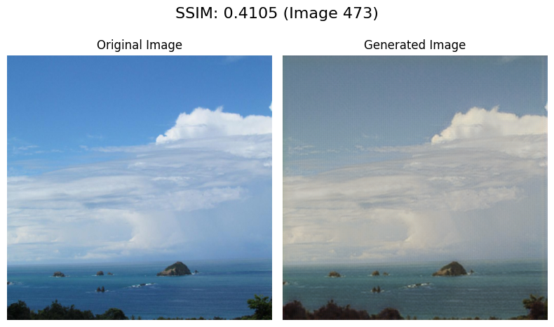

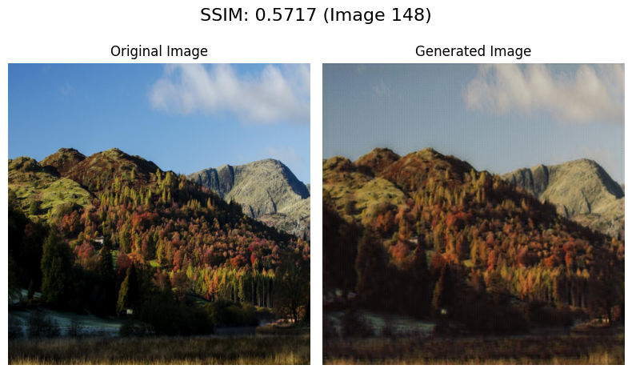

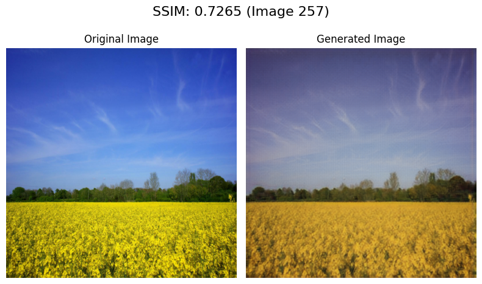

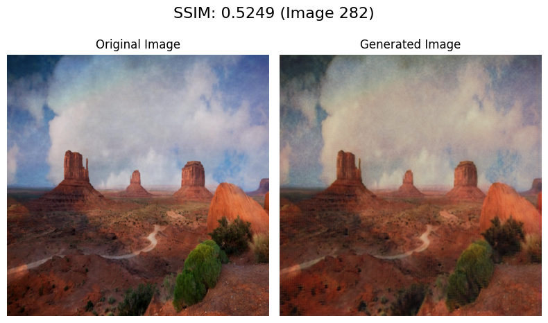

En promedio el SSIM obtenido fue de 0.6179 para la transferencia de estilo de contenido a pinturas para la iteración final.

## Transferencia de estilo: contenidos a pinturas

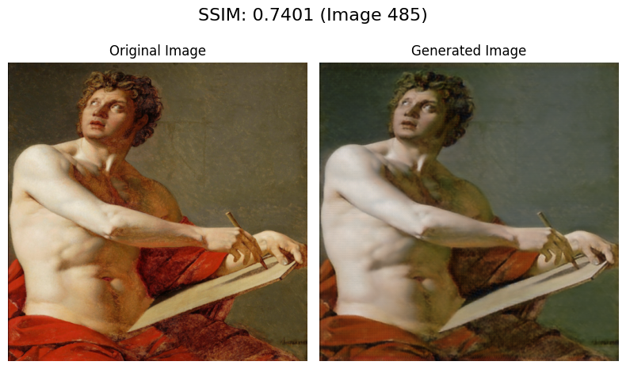

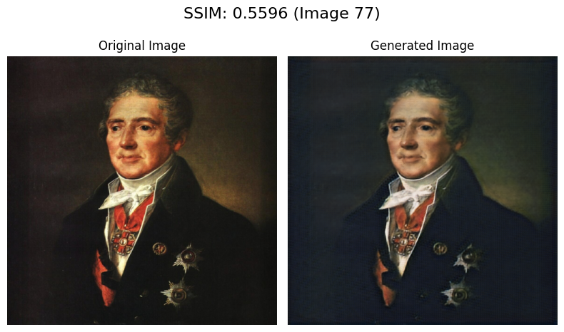

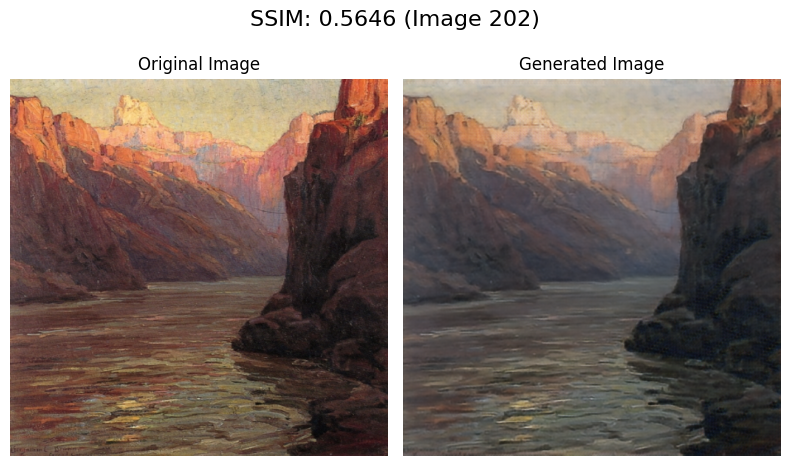

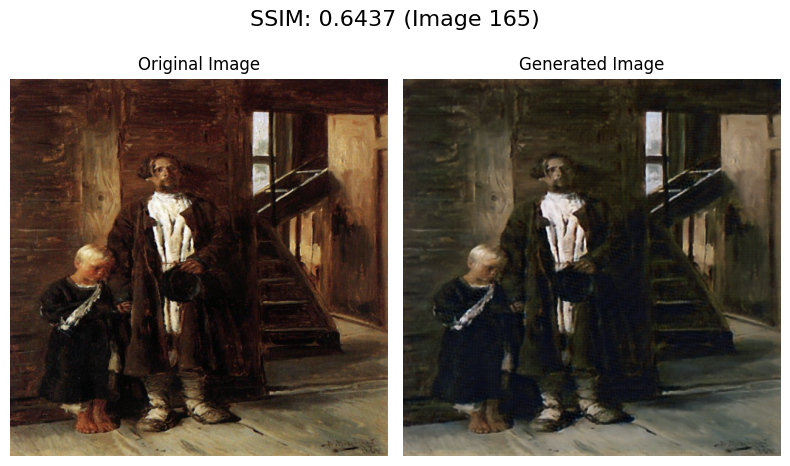

En promedio el SSIM obtenido fue de 0.6270 para la transferencia de estilo de pinturas a contenido para la iteración final.

## Consistencia de ciclo

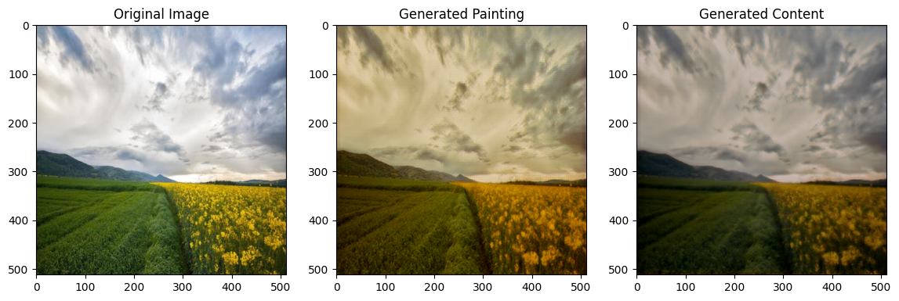

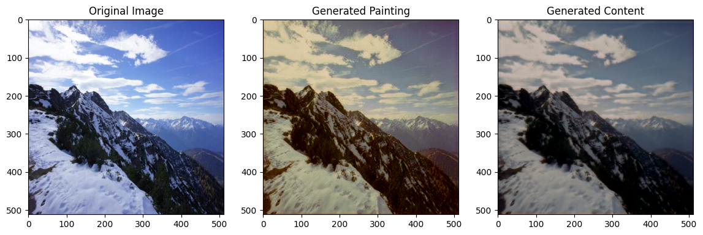

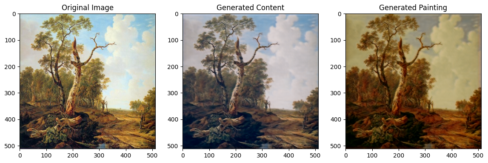

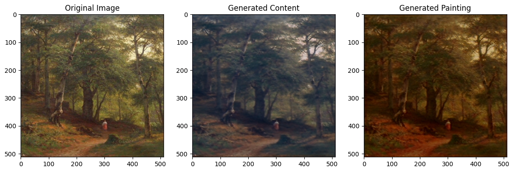

Como se puede ver, aunque existe una pérdida de información en la transformación, el modelo es capaz de mantener la coherencia en la transformación de las imágenes.

# Instrucciones de uso

## Requisitos
Para poder ejecutar el código es necesario tener instalado Python 3.7 o superior. Se recomienda utilizar un entorno virtual para instalar las dependencias del proyecto. Además, se recomienda tener una GPU con CUDA configurado para el entrenamiento del modelo.

## Instalación
Para instalar las dependencias del proyecto, ejecutar el siguiente comando:

```bash
pip install -r requirements.txt
```

## Organización
El proyecto está organizado de la siguiente manera:
- [Preparación de datos](data_preparation_notebook.ipynb): Jupyter notebook para la preparación de los datos.
- [Entrenamiento](training_notebook.ipynb): Jupyter notebook para el entrenamiento del modelo.